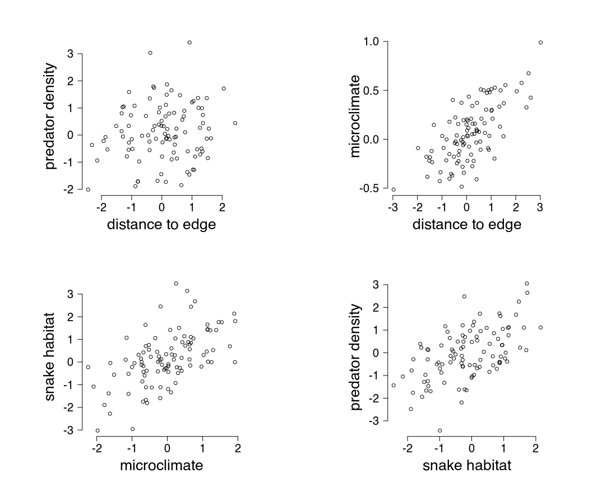
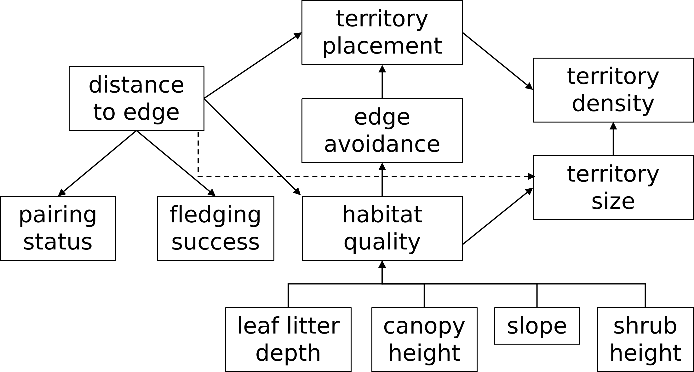

```{r setup, include=FALSE}
knitr::opts_chunk$set(echo = TRUE, fig.width=4, fig.height = 4)
knitr::opts_knit$set(global.par = TRUE)

```

```{r, echo=FALSE}
par(las=1, pty="s", bty="n", pch=16, lwd=2)
library(hypoweavr)
```


```{css style settings, echo = FALSE}
blockquote {
    padding: 10px 20px;
    margin: 0 0 20px;
    font-size: 14px;
  color: black;
  background-color: #61537e88;
    border-left: 5px solid #eee;
}
```

## hypoweavr

 hypoweavr is an R package that takes hypotheses from different studies and synthesizes them through a graphical analysis. 
<br>

To install hypoweavr, use remotes::install_github("elizagrames/hypoweavr"). If you don't already have the remotes package installed, it can be installed from CRAN with install.packages("remotes"). 

hypoweavr is a work in progress. Please send any comments, suggestions, or better-designed logos to Eliza Grames at egrames@unr.edu.

## 1. Conduct a systematic review

Before developing a conceptual model using this approach, users should conduct a systematic review to determine which studies do and do not meet their criteria for inclusion. Although users could go through the process of extracting and synthesizing hypotheses from any set of studies, doing so with a (relatively) unbiased set of papers identified through a systematic process will help with reproducibility and rigor of the resulting model. We will not go into the details of systematic reviews here and assume that users are beginning this process with a database of studies that met inclusion criteria after full-text screening and for which full texts of articles are available to the user.

The example presented here uses articles derived from a systematic review of the literature on mechanisms underlying edge and area sensitivity in forest songbirds. In short, the aim of the review was to determine what processes researchers have studied that may explain why some forest songbird population densities are lower in small forests (area sensitivity) or with distance to edge of the forest (edge sensitivity). For example, birds nesting near the edge of a forest may experience greater predation pressure from small mammals that live in the surrounding habitat, which in turn reduces their reproductive success, leads to low interannual site fidelity, and ultimately to lower population densities. The full details of the example can be read in Grames (2021).

Grames, E.M. 2021. New methods of evidence synthesis applied to systematically identify and analyze processes underlying bird-habitat relationships. University of Connecticut. http://hdl.handle.net/11134/20002:860659970

## 2. Determine boundaries on hypotheses

Many studies test multiple hypotheses, and depending on the topic of the synthesis and what the conceptual model aims to represent, users may want to not extract all hypotheses from primary studies and instead focus their efforts to only relevant hypotheses. Just as with defining inclusion and exclusion criteria for a systematic review, users need to define which hypotheses or types of hypotheses will be extracted. How these are defined will depend on the topic of the synthesis. For fairly narrowly defined questions or those on emerging topics with few studies, users may want to not place any constraints and instead extract all hypotheses to get a sense of where the field is headed. Conversely, for very broad or well-studied topics, it may be necessary to restrict what types of hypotheses are extracted.

In our example, we placed conceptual boundaries on the implied causal pathway for hypotheses we extracted and ignored any hypotheses outside those boundaries. Because we were interested in how patch size or distance to edge affect population density, we were not interested in any processes that resulted in patches of different size (e.g. "new logging operations &#10142; smaller patch sizes") or that result from population density (e.g. "dense population &#10142; heterozygosity") because they are outside the conceptual boundary for our model. For a hypothesis to be included, it had to either i) start with patch size or distance to edge in some way that could logically lead to population density directly or indirectly (e.g. "distance to edge &#10142; predation pressure" because we assume predators could affect population size), ii) end with population density and begin in some way that could logically be traced back to patch size or distance to edge (e.g. "predator density &#10142; population density" because we assume logically that predators could covary with patch size), or iii) expand on potential intermediary processes (e.g. "predator density &#10142; reproductive success"). 

```{r, out.width = "400px", echo=FALSE, fig.align='center'}

```

## 3. Extract hypotheses as implied causal or relational paths

Extracting hypotheses as implied pathways is the trickiest, and also most subjective step of this process. The approach we present here is a graphical one, and as such, we suggest users think of implied causal pathways in terms of arrows leading from one concept to another. Here, we use 'pathways' to refer to any type of causal or relational link or tie between two concepts. These pathways could be thought of as having a vaguely causal or relational implication (e.g. 'influences', 'affects', 'leads to', 'results in', 'causes', 'covaries with', etc.) whose exact meaning depends on the concepts that are connected. In some cases, these pathways are somewhat phenomenological explanations of how a system operates without defining the proximate mechanisms. For example, "distance to edge affects predator density" does not specify why this might be, and there could be more specific paths with more proximate mechanisms such as "distance to edge affects microclimate which affects suitable snake habitat which affects predator density". One way to approach thinking about this structure is to consider that each of the concepts separated by 'affects' in these examples could be thought of as occupying the x- and y-axis of a scatterplot or other visualization. Note: these are just random numbers to help visualize what we mean.

```{r, out.width = "600px", echo=FALSE, fig.align='center'}

```

The primary complication for extracting hypotheses from primary studies is that they are not always explicitly described, and interpreting what authors have written as an implied causal pathways will be up to the discretion of the user. In our case study, we found three main ways in which authors described hypotheses that we were able to extract: 1) objectives of the study or a priori hypotheses written descriptively, 2) statistical hypotheses or models defined mathematically, and 3) data gathered or results presented. Ideally, studies will include the first type of hypotheses, which should take precedent over the other two types which are more reliant on data rather than concepts. When a priori hypotheses or study objectives are not described,  mathematical descriptions are the next best option but this can be muddled when multiple competing hypotheses are presented (e.g. multi-model inference or information theoretic approaches). Extracting hypotheses based on the variables collected or results presented should be done sparingly, as papers describing studies are subject to a number of biases (e.g. publication bias towards significant results, leading to omission of unsupported hypotheses). 

## Examples of implied causal or relational pathways

Because extracting pathways depends on interpreting how authors have described primary studies, there is no single solution for how to extract implied causal pathways and each user could do it slightly differently. Indeed, the same user could extract pathways slightly differently each time when reading a study, however, the main hypothesis structure should generally be the same. We present several examples for the three main ways authors describe their hypotheses based on what we found in our case study; this is by no means an exhaustive list and is meant to be illustrative to help users think of how they might extract hypotheses for their own synthesis topics. In most cases, implied hypotheses will be sprinkled throughout the introduction, methods, and results sections.

In our examples, we include a directed acyclic graph (DAG) representing the hypotheses from each study. It is not necessary to draw these for each study when implementing this approach. The only data that hypoweavr requires for the paths is to have them represented with text, e.g. "patch size + distance to edge &#10142; bird abundance".

#### Richmond et al. 2011

>"Our study objectives were (i) to assess the relative importance of mammalian predator abundance, invertebrate prey biomass, and nest placement on nest success for Ovenbird and Wood Thrush; (ii) to determine which habitat features and matrix land-use types were most strongly associated with the abundance of mammalian nest predators and invertebrate prey in the forest fragments; and (iii) to compare the responses of species with different nesting strategies to changes in predation pressure, prey availability, and nest placement characteristics. We constructed a number of candidate models consisting of one to two predictor variables each to assess the relative importance of mammalian nest predator abundance, invertebrate prey biomass, and nest placement on nest success in Ovenbirds and Wood Thrush. ... Our study sites consisted of 12 mature, deciduous forest fragments ranging in size from 11 to 280.4 ha (mean = 46.5 ha)." (Richmond et al. 2011)

From objective (i), we know that there are three processes or factors which the authors hypothesize influence nest success, so we can write the path: "mammalian predator abundance + invertebrate prey biomass + nest placement  &#10142; nest success". Because the study is comparing forest fragments of different sizes, we can also add a path based on objective (ii): "forest fragment size &#10142; mammalian nest predator abundance + invertebrate prey". We ignore objective (iii) because it is comparing these processes across species, but is not introducing new processes.

```{r, out.width = "400px", echo=FALSE, fig.align='center'}

```

#### Chapa-Vargas and Robinson 2012

>"Thus, the main goal of the current study was to simultaneously analyze the competing effects of distance from different edge types, and composition of the surrounding landscape on nest survival of several breeding bird species. ... Based on previous results (Donovan et al. 1997, Suarez et al. 1997, Huhta and Jokimäki 2001, Chapa-Vargas and Robinson 2010), we predicted that an increasing proportion of natural habitats and edges would increase nest survival and decrease probabilities of parasitism, whereas increasing proportions of anthropogenic habitats and edges would decrease nest survival and increase probabilities of brood parasitism..." (Chapa-Vargas and Robinson, 2012)

Based on the study objectives, we know that the authors expect distance to edge affects nest survival. We can infer because they also make predictions about brood parasitism, that the main path is: "distance to edge &#10142; nest survival + brood parasitism". Reading further into the methods of the paper, we also have statistical analyses presented, which add more paths.

>"...in order to assess the effects of factors related to distance from nearest natural and anthropogenic edges, habitat composition of the landscapes immediately around nest patches, temporal effects, and brood parasitism effects on survival of birds nests. ... We used logistic regression to assess the effect of distance to nearest natural and anthropogenic edges, habitat composition of the landscapes immediately around nest patches, and temporal effects (nest initiation date) on brood parasitism." (Chapa-Vargas and Robinson, 2012)

The first phrase implies the pathway: "distance to edge + brood parasitism &#10142; nest survival". We can ignore the temporal effects because time operates independently and cannot be tied back to either distance to edge or patch size which are the boundaries of our conceptual model. The second model presented implies a similar pathway: "distance to edge &#10142; brood parasitism" which was already described in the main objectives. 

In the results section, the authors state that "Depredation was the leading cause of nest failure" (Chapa-Vargas and Robinson, 2012). This was not explicitly mentioned as a study objective or analysis, but the authors clearly had some expectation that it may be important because they collected data on nest predation even though it was not linked to distance to edge. But, we can logically infer that it could somehow be connected by hypotheses from other studies in the final model, so we add a final pathway: "nest predation &#10142; nest survival". We replaced 'nest failure' with 'nest survival' to be consistent with the main objectives and because they are antonyms.

```{r, out.width = "400px", echo=FALSE, fig.align='center'}

```


#### Ortega et al. 1999

>"After documenting lower densities of territories at forest-road edges, we present data on habitat use and reproductive success to evaluate three possible mechanisms that could produce this pattern: (1) the passive-displacement hypothesis, in which territories located adjacent to roads are limited to forested habitat such that territory centers are displaced from forest-road borders; (2) the territory-size hypothesis, whereby habitat quality is lower within edge areas, resulting in an increase in territory size that limits densities; and (3) the active-avoidance hypothesis, in which habitat quality is lower within edge areas, causing males to avoid edges and locate their territories away from roads." (Ortega et al. 1999)

The outcome measure for all these hypotheses is 'territory density' because the mechanisms seek to explain it. These objectives require us to introduce new terms because the exact phrases the authors use are a bit too long to be a node and shorter versions do not capture their full meaning. So, from objective (1), we can rephrase 'territories located adjacent to roads' as 'territory placement', and write the following path: "distance to edge &#10142; territory placement &#10142; territory density". From objective (2), we can also write "distance to edge &#10142; habitat quality &#10142; territory size &#10142; territory density". Objective (3) is also fairly straightforward and implies the pathway: "distance to edge &#10142; habitat quality &#10142; edge avoidance &#10142; territory placement &#10142; territory density".

One problem with these hypotheses is that we do not really know what the authors mean by 'habitat quality' so we continue reading through the methods section to see if there are more details that can be included. There may also be other hypotheses that are not part of the main study objectives.

>"We used a focal-male technique (Gibbs and Faaborg 1990) to assess pairing status and territory size in relation to roads." (Ortega et al. 1999) 

Pairing status was not previously mentioned, but this part of the methods section implies: "distance to edge &#10142; pairing status + territory size". Later on, the authors also introduce fledging success as a process that is influenced by distance to edge.

>"To index the proportion of territories fledging at least one young within edge and interior areas, brood detections were referenced to territory maps of males." (Ortega et al. 1999)

Because it is comparing edge and interior areas, this can be written as: "distance to edge &#10142; fledging success".

>"We measured 10 variables considered important in characterizing Ovenbird habitat... At the center of each plot, we measured depth of leaf litter, shrub height, canopy height, and slope." (Ortega et al. 1999)

Now we know how the authors are characterizing 'habitat quality' which was ambiguous before. Here, we omit the descriptions of how the other 6 variables were measured for clarity in the example. Because 'habitat quality' results from these different properties but we have no information on how the variables are related, we write: "leaf litter depth + shrub height + canopy heigh + slope &#10142; habitat quality". 

```{r, out.width = "400px", echo=FALSE, fig.align='center'}

```

#### Burke and Nol 2001

>"Therefore, we predicted that yearling male Ovenbirds would constitute a higher proportion of territorial males in forest fragments than in contiguous forest. As a mechanism to explain these differences, we predicted lower return rates of males to fragments than to contiguous forests, which should create more vacancies in the fragments than in the contiguous forests (Møller 1991; Weinberg and Roth 1998). We tested these predictions by capturing, banding, and ageing territorial male Ovenbirds in 12 forest fragments and two contiguous forest sites in the breeding seasons of 1996 through 1999, and recording resighting rates of birds in 1997 and 1998. We also weighed and measured birds to determine whether the condition of territorial males was affected by either age or size of the woodlot." (Burke and Nol, 2001)

Because the authors are comparing forest fragments to contiguous forest, we can call the starting point "fragment size". The first sentence implies the pathway: "fragment size &#10142; male age" (because it is shorter to write). The second implies: "fragment size &#10142; male return rates &#10142; territory vacancy" ('vacancies' is too vague to interpret later in the full model). Because condition could be affected by two different things, the final sentence suggests: "fragment size + age &#10142; body condition".


```{r, out.width = "400px", echo=FALSE, fig.align='center'}

```


#### Schneider and Miller 2014

>"We quantified avian community structure (i.e. the number of species and their relative abundances) in forest remnants in the Chicago metropolitan area with varying amounts of invasive vegetation. Specifically, we addressed the following questions: How do measures of invasive vegetation correlate with avian community structure? How do particular avian guilds and individual species respond to exotic vegetation? Finally, how do the effects of exotic vegetation on birds compare in magnitude to those associated with other local and landscape characteristics?" (Schneider and Miller 2014)

At first glance, this study does not necessarily meet our inclusion criteria because it does not start with patch size or distance to edge, though it does end with bird abundance. It is unclear what 'landscape characteristics' are, however, so to find out what 'landscape characteristics' are and if they are related to patch size or distance to edge, we can check the methods section. 

>"We delineated forest remnants in which the plots were embedded and calculated the perimeter of each remnant (m) and total contiguous forested area (ha). We also measured the distance between each plot center and the nearest forest edge (m)." (Schneider and Miller 2014)

Now, we know that: "distance to edge + patch size" are the 'landscape characteristics' so we can use these in place of that for the main pathway. We can ignore perimeter because it is not part of our conceptual boundaries. We can write the first question posed by the authors as: "invasive vegetation &#10142; avian community". The second question is outside the scope of our model because it is about comparing different species. Knowing what 'landscape characteristics' are now, we can write the third question as: "distance to edge + patch size + invasive species &#10142; avian community".

```{r, out.width = "400px", echo=FALSE, fig.align='center'}

```

# 4. Extract metadata

It may be of interest to users to create multi-dimensional networks that include not just linked hypotheses, but also characteristics of the included studies. For example, users could extract study authors to do a concurrent bibliometric analysis, or whether or not a hypothesis was supported (note: vote-counting should be avoided as an alternative to meta-analysis, but may be useful as part of building a conceptual model). Users may also want to use study characteristics to subset studies and compare conceptual models built from different subtopics. In our case study (Grames 2021), for example, we created different models based on the type of habitat surrounding a forest edge and for different species. Some metadata may also be useful for investigating trends, such as years of data collection, latitude or longitude where a study was conducted, or other scales. 

Note that this step is optional, but resulting networks are more interesting and additional analyses can be done with metadata that may covary with which hypotheses are studied. Users should consider what metadata they would like to use as covariates when designing their synthesis.

The hypotheses and study metadata for our case study from Grames (2021) are pre-loaded in hypoweavr as an example. We will load this dataset in with the code below so they are in our working environment, then look at the first few rows of the data. 

```{r}
load("../data/studies.rda")
knitr::kable(head(studies, 3))
```

# 5. Merge synonymous terms

Many authors use different terms to describe the same, or related, concepts and the distinction may or may not be useful in the context of the conceptual model. When extracting hypotheses, we recommend that users retain the original terms used by authors unless they are clear synonyms or antonyms (e.g. "nest success" and "nest failure" are direct antonyms and can be collapsed without preserving the original phrase since they only differ in the sign of the causal relationship). 

For simplicity when presenting or interpreting a model, it can be valuable to collapse similar concepts and represent them with a single term, however, in many cases the distinctions do matter. For example, "nest success" (i.e. at least one chick fledged) and "number of fledglings" both represent "reproductive success" but may be influenced by different processes (e.g. predation may influence all or nothing nest success, but food availability may influence how many chicks fledge). It is best to preserve this distinction but not necessarily to represent it in the model where the more generic 'reproductive success' term may make the model more interpretable.

Rather than having to choose between a more detailed model or one with collapsed concepts, we suggest that users adopt a flexible approach using an n-level ontology. In the ontology, layer n consists of exact synonyms or antonyms, and higher order levels (e.g. n-1) are conceptual groupings of those synonyms. To continue with the nest success theme, we could imagine a 2-level ontology where level 1 contains the group 'reproductive success' within which are 'nest success' and 'number of fledglings'; level 2 is nested within level 1 and contains synonyms for 'nest success' (e.g. 'nest failure') and 'number of fledglings' (e.g. 'number of fledged young'). This ontology can then be used to reclassify pathways and generate models at different levels of specificity.

```{r, echo=F}
knitr::kable(data.frame(Concept=c("Reproductive success", "", "", ""), 
           Term=c("nest success", "", "number of fledglings", ""),
           Synonyms=c("nest success", "nest failure", "number of fledglings", "number of fledged young")))
```

Although users could create the higher levels of an ontology in advance based on knowledge of the system, inevitably many terms will be omitted from the synonym list. We recommend completing path extraction before creating the ontology, and using the list of terms extracted from the texts as the basis for the ontology.

In our case study (Grames 2021), we only created an ontology for synonyms or related terms and did not group them into higher levels.

```{r}
load("../data/ontology.rda")
knitr::kable(head(ontology, 10))
```

This table is human-readable with blank space left in the 'Term' column, however, it isn't very machine-readable. To make it more useful, we need to fill in the blank spaces with the associated term. To do this, we can use the function fill_rows(), which is a verbatim copy of the same function in the <a href="https://github.com/elizagrames/topictagger">topictagger</a> package.

```{r}
ontology <- fill_rows(ontology)
knitr::kable(head(ontology, 10))
```

# 6. Create network graphs

At this point, users should have 1) hypotheses associated with study metadata, and 2) an ontology defining synonyms (and potentially other groups). The remaining steps use that information to generate graphs representing study hypotheses, global graphs merging hypotheses across studies, and assemble studies in different ways to analyze the graphs (e.g. creating a cumulative time series of graphs or using sliding windows to explore trends). 

## 6.1. Data prep
First, we need to clean up the pathways and get them in the format expected by hypoweavr. This involves cleaning up the punctuation and replacing synonymous terms using the ontology. In our example, we have used ">" to represent implied causal relationships, and "+" as a shorthand for indicating that a group of variables share the same relationship to the variable(s) on the other end of the relationship. For example, instead of writing "patch size > bird abundance" and "distance to edge > bird abundance" we can write "patch size + distance to edge > bird abundance". When a single study has more than one implied causal pathway, we separated them by ";". 

```{r}
# First, let's pull the pathways out of the main dataset
pathways <- studies$Pathways
head(pathways)

# We need to clean up the punctuation to be consistent and in the right format
cleaned_paths <- clean_path(path=pathways, 
                            join = "+", 
                            cause = c(">", "="), 
                            sep=";")
head(cleaned_paths)

```

Now the punctuation and format of all our written pathways is standardized, but the terms used are not. One study may say 'nest success' and other 'nest survival' and we want to merge those into the same concept so that they are represented by a single node in the network. To do this, we use our ontology to group synonyms and replace them with a single term.

```{r}
# Use the ontology to replace synonymous terms
merged_paths <- replace_terms(path=cleaned_paths, 
                              terms=ontology$Term, 
                              synonyms = ontology$Synonyms)

head(merged_paths)

# Take a look at item 6; notice 'nest placement' is now 'nest site selection', 
# 'understory vegetation density' is now 'vegetation structure', etc.

```

## 6.2. Create directed acyclic graphs (DAGs)

First, we need to create one graph for each study in our dataset. We can then recombine and analyze these graphs based on study characteristics or other metadata we have collected. For example, in the code below, we use the first year of data collection to merge studies that began in the same year. In some years, there are no studies in the database initiated in that year, so they are left blank.

```{r}

# This will create a list of graph objects the same length as the number of studies
study_graphs <- generate_graph(merged_paths)

# Let's create a new variable for first year of data collection
firstyear <- unlist(lapply(studies$Years.of.data.collection, function(x){
  as.numeric(strsplit(x, "-")[[1]][1])
}))

# Now we can create a shorter series of graphs where all studies from the same
# year are merged together into a single graph
# This can be useful, e.g. for looking at trends in thinking over time
by_year <- create_series(graphs = study_graphs, 
                         order.by = firstyear, 
                         sort.order = 1975:2020)

# If we have ordered our graphs by something numerical (e.g. year, latitude) 
# but we don't want to analyze each year separately, we could create a time 
# series of graphs based on sliding windows
window_dag <- create_windows(by_year, window.size=5, startpoint = 1)

# Or we could create a cumulative graph where each one builds on all previous
# graphs in the series, e.g. looking at accumulation of hypotheses over time
cumulative_year <- create_cumulative(graphs = study_graphs, 
                                     order.by = firstyear, 
                                     sort.order = 1975:2020)

# We could also pull out a graph for all studies with some shared characteristic
# For example, a unified graph of all studies done in aspen-birch forests, which
# we could compare to one done in maple-beech-birch
aspen <- merge_graphs(study_graphs, by=studies$Forest.type=="aspen birch")
maple <- merge_graphs(study_graphs, by=studies$Forest.type=="maple beech birch")

```

We can then plot the graphs to visualize how hypotheses are related to each other. For example, the aspen network is shown below. Because everyone will want to visualize their networks differently, there are no plotting functions included in hypoweavr. We suggest using igraph for static plots, or use visNetwork or tkplot to create interactive plots. If one of the end products is an interactive webpage with results of the network building, we recommend visNetwork; example code for the Shiny app created as part of our case study can be found at https://github.com/elizagrames/conceptual-models/. 

```{r, echo=F, fig.width=8, fig.height=8}
igraph::plot.igraph(
  igraph::simplify(aspen),
  edge.arrow.size = 0.5,
  edge.color = "#00000088",
  vertex.color = "white",
  vertex.frame.color = "white",
  vertex.label.family = "Arial",
  vertex.label.dist = 0,
  vertex.label.color = "black",
  vertex.size = sqrt(igraph::strength(aspen)) * 3
)
```


## 6.3. Analyze graphs

Because we have represented the hypotheses from each study (or each year) as a network, there are many, many different analyses that could be done with it depending on the type of synthesis being done and the questions being addressed. There are a few simple analyses built into hypoweavr, which we demonstrate below, but users should consider more sophisticated approaches and software that is dedicated solely to graph analysis (e.g. the igraph package). 

Note that some analyzes which depend on graphs being directed (e.g. transitive reduction) may not function as expected. Although hypotheses within a study should be internally consistent and form a directed acyclic graph (DAG), when individual study DAGs are combined, they may produce cycles or conflicting directions for causal relationships. 

### Dissimilarity

The dissimilarity metric included in hypoweavr is based on Schieber et al. (2017), which is based on topological differences between graphs. This can be useful when thinking about how the structure of the network changes over time. 

```{r}

# Dissimilarity between two graphs
calc_dissimilarity(aspen, maple)

# We could also calculate dissimilarity over a series of graphs, for example
# using the cumulative graphs by year to see when the network stabilizes
cumulative_diss <- calc_dissimilarity(cumulative_year)
plot(cumulative_diss)

# Or we could use the sliding windows network to to see how much the field 
# is changing over time and when there are bursts of ideas 
time_diss <- calc_dissimilarity(window_dag)
plot(time_diss)

```


### Graph features

Users may want to look at simple metrics like how the number of nodes (i.e. factors or concepts in the model) or edges (i.e. relationships between those concepts) change over time or other dimensions. There are two simple functions in hypoweavr for doing this: one that calculates the number and identity of new features in a graph that are not in the comparison graph, and one that calculate the number and identity of shared features between two graphs.

```{r}

# We can calculate the number of new features (nodes and edges) in the network
# created from only studies in maple compared to the network for aspen
# Note that y gets compared to x, so this returns new features in y that are not in x
new_features(x=aspen, y=maple, return="counts")

# If we want to know what those new features are, we can return feature instead
new_features(x=aspen, y=maple, return="features")

# Similarly, we can calculate the number of shared features that appear in the
# graph for both aspen and maple, and return what those features are
shared_features(x=aspen, y=maple, return="counts")
shared_features(x=aspen, y=maple, return="features")

# If we calculate new features for a longer list of graphs, we can track growth
# of the network, for example using the cumulative graphs by year

cumulative_features <- new_features(cumulative_year, return="counts")
plot(cumulative_features$nodes ~ seq(1975, 2020, 1), type="l", ylab="Network nodes", xlab="Year")
plot(cumulative_features$edges ~ seq(1975, 2020, 1), type="l", ylab="Network edges", xlab="Year")

# Shared features for cumulative graphs aren't very interesting, because we already
# know that each graph shares all the same features of the previous graph

```

### Node and edge characteristics

In the network, the hypotheses are represented by concepts (nodes) and the relationships between them (edges). Assessing characteristics of the nodes and edges can be useful for determining which hypotheses are most important, how hypotheses have changed over time, etc. hypoweavr includes a wrapper function to pull graph metrics for one or more graphs, including time series of graphs, using underlying functions from the igraph package. We can then visualize changes in graph metrics over time. There are many, many different ways users can approach analyzing graphs and the characteristics of nodes and edges, which we do not go into here. 

```{r}

# We can generate node metrics for a single graph 
graph_metrics(aspen, metric="page_rank", return.df = FALSE)

# Or we can generate metrics for multiple graphs, which returns a list
graph_metrics(list(aspen, maple), metric="page_rank", return.df = FALSE)

# The number and order of items is not the same for each entry in our list
# But in some cases, we may want a data frame where all possible entries appear
# for every single graph, even if that node/edge is not present
# In this case, we can set return.df to TRUE
nodestrength <- graph_metrics(cumulative_year, metric="strength", return.df=T)
knitr::kable(head(nodestrength[,1:15]))

```


```{r, echo=F}
# Note this is viridis::magma(160, begin=0, end=1)
# Not a dependency, however, so adding as plain text
pal <- c("#000004FF", "#010105FF", "#010108FF", "#02020BFF", "#02020EFF", 
"#030312FF", "#050415FF", "#060518FF", "#07061CFF", "#08071FFF", 
"#0A0822FF", "#0C0925FF", "#0D0A2AFF", "#100B2DFF", "#110D30FF", 
"#130D34FF", "#150E37FF", "#160F3CFF", "#19103FFF", "#1B1043FF", 
"#1D1147FF", "#1F114AFF", "#21114FFF", "#241253FF", "#261256FF", 
"#29115AFF", "#2B115EFF", "#2D1162FF", "#311165FF", "#341068FF", 
"#36106BFF", "#390F6DFF", "#3C0F70FF", "#3F0F72FF", "#410F75FF", 
"#440F76FF", "#461078FF", "#491078FF", "#4C117AFF", "#4F127BFF", 
"#51127CFF", "#53137DFF", "#56147DFF", "#59157EFF", "#5B167FFF", 
"#5D177FFF", "#601880FF", "#631980FF", "#651A80FF", "#681C81FF", 
"#6A1C81FF", "#6D1D81FF", "#6F1F81FF", "#721F81FF", "#742181FF", 
"#762181FF", "#792282FF", "#7B2382FF", "#7E2482FF", "#812581FF", 
"#832681FF", "#862781FF", "#882781FF", "#8B2981FF", "#8D2A81FF", 
"#902A81FF", "#932B80FF", "#952C80FF", "#982D80FF", "#9A2E7FFF", 
"#9C2E7FFF", "#A02F7FFF", "#A2307EFF", "#A5317EFF", "#A7327DFF", 
"#AA337DFF", "#AD347CFF", "#AF347BFF", "#B2357BFF", "#B4367AFF", 
"#B73779FF", "#BA3878FF", "#BC3977FF", "#BF3A77FF", "#C13B75FF", 
"#C43C75FF", "#C73D73FF", "#C93E73FF", "#CC3F71FF", "#CF4070FF", 
"#D1416FFF", "#D3436EFF", "#D6456CFF", "#D8456CFF", "#DB476AFF", 
"#DD4869FF", "#DF4A68FF", "#E14D66FF", "#E34E65FF", "#E55064FF", 
"#E75363FF", "#E95462FF", "#EB5760FF", "#EC5860FF", "#EE5B5EFF", 
"#EF5E5EFF", "#F1605DFF", "#F2635CFF", "#F3655CFF", "#F4695CFF", 
"#F66B5CFF", "#F66E5CFF", "#F7715CFF", "#F8745CFF", "#F9785DFF", 
"#F97A5DFF", "#FA7D5EFF", "#FA805FFF", "#FB835FFF", "#FB8761FF", 
"#FC8961FF", "#FC8C63FF", "#FC8F65FF", "#FD9366FF", "#FD9668FF", 
"#FD9969FF", "#FD9B6BFF", "#FE9E6DFF", "#FEA26EFF", "#FEA571FF", 
"#FEA872FF", "#FEAA74FF", "#FEAD77FF", "#FEB179FF", "#FEB47BFF", 
"#FEB77DFF", "#FEB97FFF", "#FEBC82FF", "#FEC084FF", "#FEC287FF", 
"#FEC589FF", "#FEC88CFF", "#FECC8FFF", "#FECE91FF", "#FED194FF", 
"#FED496FF", "#FED799FF", "#FDD99BFF", "#FDDD9FFF", "#FDE0A1FF", 
"#FDE3A4FF", "#FDE5A7FF", "#FDE9AAFF", "#FDEBADFF", "#FCEEB0FF", 
"#FCF1B3FF", "#FCF4B6FF", "#FCF7B9FF", "#FCFABCFF", "#FCFDBFFF"
)
```


```{r, echo=FALSE, fig.width=8, fig.height=4}
dat <- nodestrength
par(las=1, bty="n", pty="m", xpd=T)
for(i in 1:nrow(dat)){
  if(i==1){
    plot(dat[i,] ~ as.numeric(colnames(dat)), 
         ylim=c(min(dat, na.rm=T), max(dat, na.rm=T)), type="l",
          xlim=c(1975, 2050),
         axes=F,
         col=pal[i],
         ylab="Node strength", xlab="Year")
        axis(1, at=seq(1975, 2020, 15)); axis(2)
text(max(as.numeric(colnames(dat)))-1, dat[i,ncol(dat)], rownames(dat)[i],
         pos=4, cex=0.6)
  }else{
    lines(dat[i,] ~ as.numeric(colnames(dat)),
          col=pal[i])
    if(dat[i,ncol(dat)]>15){
        text(max(as.numeric(colnames(dat)))-1, dat[i,ncol(dat)], rownames(dat)[i],
         pos=4, cex=0.6)
    }
  }
}

```

```{r}

# We can calculate edge metrics using the same function
graph_metrics(aspen, metric="edge_betweenness")

# For single graphs, we can look at metrics in terms of relative importance
aspen_btwn <- sort(graph_metrics(aspen, metric="edge_betweenness"))
labels <- names(aspen_btwn); labels[aspen_btwn<5]<- ""
plot(aspen_btwn)
text(aspen_btwn, labels, cex=0.5, adj=0)

graph_metrics(list(aspen, maple), metric="edge_betweenness", return.df = FALSE)

# We can also look at changes in metrics over time
btwn <- graph_metrics(cumulative_year, metric="edge_betweenness", return.df=T)
knitr::kable(head(btwn[,1:15]))

```

```{r, echo=FALSE, fig.width=8, fig.height=4}
dat <- btwn
dat <- dat[order(dat[,ncol(dat)], decreasing = T),]


par(las=1, bty="n", xpd=T, pty="m")

for(i in 1:nrow(dat)){
  if(i==1){
    plot(dat[i,] ~ as.numeric(colnames(dat)), 
         ylim=c(min(dat, na.rm=T), max(dat, na.rm=T)), xlim=c(1975, 2050),
         type="l", axes=F,
         col=pal[i],
         ylab="Edge betweenness", xlab="Year")
    axis(1, at=seq(1975, 2020, 15)); axis(2)
            text(max(as.numeric(colnames(dat)))-1, dat[i,ncol(dat)], rownames(dat)[i],
         pos=4, cex=0.6)

  }else{
    lines(dat[i,] ~ as.numeric(colnames(dat)),
          col=pal[i])
    if(dat[i,ncol(dat)]>200){
        text(max(as.numeric(colnames(dat)))-1, dat[i,ncol(dat)], rownames(dat)[i],
         pos=4, cex=0.6)
    }
  }
}

```
